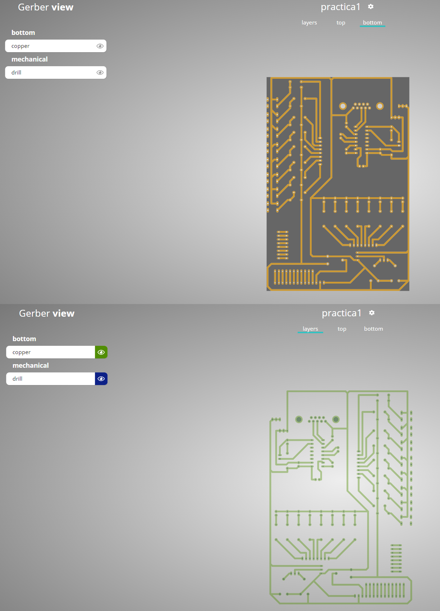

### Report
For this practice, modify only the Conclusion section. Commit an push the changes on the fork of this repository and add
upload the link on Canvas.

### File uploads
Commit and push the files with extensions .pro, .gbl, and .drl  created once you completed all the steps of the document in the repository.

### Demonstration
Screenshot the image of the complete PBC board whith the attached electronic components using the 3d viewer of KiCad.
```diff
+ Track Design (Gerber Viewer) Results
```


```diff
+ Complete PBC (3D KiCad Viewer) Results
```


## Conclusion

En esta práctica pude observar mi diseño final de la placa usando el “3D bien” que nos proporciona KiCad, el único detalle es que al usar una librería sin modelado 3D nuestra placa final solo muestra la misma sin los componentes anclados a ella. Esta parte no fue para nada difícil puesto que solo era seguir una serie de sencillos pasos siempre y cuando hayas hecho todo de manera correcta en las prácticas pasadas. Por último, es muy amigable con el usuario y fácil de diseñar en esta herramienta, inclusive lo usaría de referencia en el futuro. Sinn embargo, como cualquier software tiene su nomenclatura y reglas a seguir, en caso de no conocerlas o entenderlas pasaras un mal rato hasta poder crear lo que uno esta buscando.  
